# Reconductor

Reconductor is a deterministic, human-directed enterprise security reconnaissance platform for authorized bug bounty and penetration-testing work. It automates repeatable discovery and safe scanning while keeping scope, policy, approval, and vulnerability decisions under human control.

The platform does **not** contain an LLM, planner, agent loop, prompt engine, embeddings, or unrestricted shell interface. A future local planner may propose a `PlanProposal`; Reconductor must validate it, require human review, and create trusted task, workflow, step, approval, idempotency, attribution, and `ActionRequest` records itself.

## Safety model

Every network capability is checked against an explicit scope and policy before execution. Passive and low-risk capabilities may run within configured limits. Moderate and high-risk actions require the applicable approval. Forbidden actions never run. Workflow input can select a registered capability and provider; it cannot supply an executable or command array.

Capability manifests also declare authentication, directory-fuzzing, cross-origin, and intrusive behavior. These restrictions and UTC scan windows are enforced at the registry immediately before provider execution and produce sanitized policy-decision audit events. Artifact retention is persisted as an expiry and collected from local storage with an audit trail.

Internal capabilities use the same contract discipline as command providers: concrete typed inputs and outputs, closed JSON Schemas, strict unknown-field rejection, and semantic validation during workflow-definition loading and immediately before execution.

Endpoint intelligence is deterministic and evidence-based. Scope-authorized HTTPX, Katana, and GAU records are classified using request shape, response metadata, JavaScript relationships, authentication indicators, technologies, API-schema evidence, history, and source confidence. Every promoted endpoint carries its labels, weighted signals, score, confidence, and provenance into the normalized result and changes report.

Burp-compatible scope JSON is the targeting source of truth. Exact active seeds stay separate from passive discovery roots: `*.dev.example.test` may derive the passive root `dev.example.test`, but that root is never probed unless a complete protocol/host/port/path evaluation independently authorizes it. Exclusions always win.

The built-in Nuclei profile excludes denial-of-service, brute-force, fuzzing, and intrusive tags. Scanner matches are persisted as candidate findings with a default confidence, not as verified findings. Independent deterministic verification or human review is required before promotion.

## Architecture

```mermaid
flowchart TD
    A[Researcher] --> B{How is the run started?}

    B --> C[Direct manual workflow run<br/>CLI]
    B --> D[Persistent scheduled execution<br/>Cron or Run Now from CLI / local console]

    D --> D1[Materialize or enqueue ScheduledExecution]
    D1 --> D2[Claim execution with a lease]
    D2 --> E
    C --> E

    E[Shared orchestration service] --> E1[Load current program scope]
    E1 --> E2[Rebuild target plan]
    E2 --> E3{Unacknowledged scope expansion?}
    E3 -->|Yes| E4{Scheduled execution?}
    E4 -->|Yes| D3[Close as blocked_scope_change<br/>Pending scope review]
    E4 -->|No| C1[Stop; rerun with explicit acknowledgement]
    C1 --> C
    E3 -->|No| F[Build and validate selected workflow]

    F --> F1[Create or resume Task]
    F1 --> F2[Create or resume WorkflowRun<br/>Attach scheduled lineage atomically when present]
    F2 --> G[Apply policy, scope, rate, and concurrency checks<br/>to each capability execution]

    G --> H0{Continuous workflow<br/>with discovery roots?}
    H0 -->|Yes| H1[discover.subdomains<br/>Subfinder]
    H0 -->|No| H[targeting.prepare<br/>Normalize, deduplicate, scope-filter]
    H1 --> H

    H --> I1[resolve.dns<br/>DNSx]
    I1 --> I2{Authorized common ports?}
    I2 -->|Yes| I3[scan.ports<br/>Naabu]
    I2 -->|No| I4[probe.http<br/>HTTPX]
    I3 --> I4

    I4 --> J[compare.assets]
    J --> K1[crawl.web<br/>Katana when changed crawl targets exist]
    K1 --> L[classify.endpoint]

    H --> K0{Archive discovery configured?}
    K0 -->|Yes| K2[discover.archive_urls<br/>GAU]
    K0 -->|No| L
    K2 --> L

    L --> M[Preliminary recon brief<br/>report.changes]
    M --> N[Persistent change inbox]
    N --> N1[High, medium, and low priority changes]
    N --> N2[Researcher review state<br/>unreviewed, interesting, investigating,<br/>expected_change, not_relevant, resolved]

    L --> O0{Changed Nuclei scan targets?}
    O0 -->|No| M2[Enriched recon brief<br/>without scanner matches]
    O0 -->|Yes| O{Approve moderate step?}
    O -->|Rejected| P[Close StepRun, WorkflowRun, Task,<br/>and related ScheduledExecution immediately]
    O -->|Approved| Q[scan.nuclei<br/>Constrained safe profile]

    M --> M2
    Q --> M2
    M2 --> N

    Q --> R[Candidate findings]
    R --> N
    R --> S[Verification records]
    S --> S1[Compatibility verdict]
    S --> S2[Evidence verdict]
    S --> S3[Impact verdict]

    S1 --> T{Latest evidence observed<br/>and impact confirmed?}
    S2 --> T
    S3 --> T
    T -->|No| U[Remain candidate / reviewed evidence]
    T -->|Yes| V[Verified finding]

    D3 --> W[Researcher reviews and acknowledges scope expansion]
    W --> X[Queue Run Now or wait for a later cron occurrence]
    X --> D

    N --> Y[Persist execution state, artifacts, observations,<br/>change items, findings, and audit events]
    P --> Y
    U --> Y
    V --> Y
    D3 --> Y

    Y --> Z[Local operator console<br/>Sanitized read models]
    Z --> Z1[Programs]
    Z --> Z2[Schedules]
    Z --> Z3[Scheduled executions]
    Z --> Z4[Pending scope expansions]
    Z --> Z5[Change inbox]
    Z --> Z6[Approvals]
    Z --> Z7[Candidates and verified findings]
    Z --> Z8[Audit events]

    Y --> DB[(PostgreSQL)]
    Y --> FS[(Artifact store and<br/>workflow-state files)]

    style A fill:#1f2937,color:#fff
    style E fill:#2563eb,color:#fff
    style L fill:#2563eb,color:#fff
    style N fill:#059669,color:#fff
    style Q fill:#d97706,color:#fff
    style V fill:#7c3aed,color:#fff
    style D3 fill:#b91c1c,color:#fff
    style W fill:#b91c1c,color:#fff
```



The local console's **Run Now** action enqueues a persistent scheduled execution; only `platform workflow run` is the direct manual path. Scope acknowledgement closes the review item but does not revive the blocked execution, so the operator must queue a new run or wait for a later cron occurrence.

The persisted hierarchy is `Program -> Task -> WorkflowRun -> StepRun -> ToolRun`. Artifacts, observations, candidates, approvals, and audit events retain those execution IDs.

## Current capabilities

| Capability | Provider | Risk |
|---|---|---|
| `discover.subdomains` | Subfinder; optional Chaos | passive |
| `resolve.dns` | DNSx | low |
| `scan.ports` | Naabu | low |
| `probe.http` | HTTPX | low |
| `crawl.web` | Katana, including configured headless mode | low |
| `discover.archive_urls` | GAU | passive |
| `targeting.prepare` | in-process scope filter and deduplicator | passive |
| `classify.endpoint` | in-process | passive |
| `scan.nuclei` | constrained Nuclei provider | moderate |
| `compare.assets` | in-process | passive |
| `report.changes` | in-process | passive |

There are two generic scope-driven definitions: `continuous-web-recon` adds passive discovery for derived/operator-approved roots, while `authorized-web-baseline` operates only from exact active seeds. Both support multiple unrelated domains and produce a preliminary recon brief before optional Nuclei approval.

## Local setup

Requirements: Go 1.25+, PostgreSQL 15+, Redis 7+, and the enabled ProjectDiscovery/GAU executables on `PATH` for local workflow execution. The Docker worker image builds the pinned provider binaries with Go 1.26 because ProjectDiscovery HTTPX v1.10.0 requires that newer toolchain.

On systems with same-name commands, set the corresponding `*_EXECUTABLE` variable in `.env` to the full binary path. In particular, `HTTPX_EXECUTABLE` must resolve to [ProjectDiscovery HTTPX](https://docs.projectdiscovery.io/opensource/httpx/install), not the Python HTTPX client. The provider verifies ProjectDiscovery HTTPX with `-version` before probing any target.

Check the complete local execution environment without sending target traffic:

```powershell
go run ./cmd/platform doctor
go run ./cmd/platform doctor --format json
```

The doctor resolves every configured provider, verifies its identity and tested version family, discovers the active Nuclei template version, and tests PostgreSQL and Redis connectivity. External provider execution uses the same compatibility checks, so a successful doctor cannot be bypassed by a later workflow step. See [environment diagnostics](docs/doctor.md).

```powershell
Copy-Item .env.example .env
docker compose up -d postgres redis
go run ./cmd/platform migrate
go run ./cmd/platform capabilities
```

Set an optional project/data root for portable logical scope references, then
start the persistent scheduler. Relative references resolve beneath
`SCOPE_ROOT`; when it is unset they remain relative to the process working
directory.

```powershell
$env:SCOPE_ROOT = (Get-Location).Path
go run ./cmd/scheduler
```

Create a program using an explicit Burp-compatible scope file:

```powershell
go run ./cmd/platform program create --name example --platform private --scope scope/example.json
go run ./cmd/platform program list
```

New programs should store logical references such as `scope/example.json`.
Absolute paths remain supported but are intentionally not remapped. To repair
an existing locator without changing authorization, use `scope update`; it
requires the loaded scope and target-plan digests to match the stored values:

```powershell
go run ./cmd/platform scope update --program-id <uuid> --scope scope/example.json
```

Review the non-network plans, then run without a root-domain argument:

```powershell
go run ./cmd/platform scope plan --scope .\scope\example.json
go run ./cmd/platform workflow plan --program-id <uuid> --scope .\scope\example.json
go run ./cmd/platform workflow validate --scope .\scope\example.json
go run ./cmd/platform workflow run --program-id <uuid> --scope .\scope\example.json --objective "Authorized low-rate baseline reconnaissance"
```

The run pauses before the moderate Nuclei step unless the operator explicitly supplies `--approve-moderate`. Resume from the saved run state with `--resume <workflow-run-id>` and the original program/scope/plan flags. Successful unchanged steps retain their idempotency keys and are not repeated.

Independent ready workflow branches execute concurrently in deterministic waves. Completion state is committed in stable graph order, and program, provider, and host concurrency budgets remain authoritative within each runner process. `platform task cancel <task-id>` propagates cancellation into an actively running local provider process.

Katana headless crawling requires both `--headless` and a policy that permits it. The setting is passed to Katana rather than merely accepted by the CLI.

Use `--workflow authorized-web-baseline` for exact seeds only. `--discovery-root` is repeatable, passive-only, and requires `--discovery-root-reason`. Deprecated `--domain` is treated only as an auditable passive root. A detected scope expansion requires `--acknowledge-scope-expansion` after review.

## Usage examples

The examples below use `scope/acme.json` as a placeholder for your own Burp-compatible scope export. Replace it with the scope file you want to test.

### Docker-first run

Build and start the local database, Redis, and worker image:

```powershell
Copy-Item .env.example .env
docker compose up -d --build worker
docker compose run --rm --entrypoint /usr/local/bin/platform worker migrate
```

Check the environment without sending target traffic:

```powershell
docker compose run --rm --entrypoint /usr/local/bin/platform worker doctor
docker compose run --rm --entrypoint /usr/local/bin/platform worker capabilities
```

Mount the local `scope` directory beneath an explicit container scope root when
running CLI commands inside Docker. Persist the same logical reference used by
the local scheduler:

```powershell
$scopePath = "scope/acme.json"
$program = docker compose run --rm -e SCOPE_ROOT=/workspace -v "${PWD}\scope:/workspace/scope:ro" --entrypoint /usr/local/bin/platform worker program create --name acme --platform private --scope $scopePath | ConvertFrom-Json
$program.id
```

Review scope and workflow plans before running network steps:

```powershell
docker compose run --rm -e SCOPE_ROOT=/workspace -v "${PWD}\scope:/workspace/scope:ro" --entrypoint /usr/local/bin/platform worker scope plan --scope $scopePath
docker compose run --rm -e SCOPE_ROOT=/workspace -v "${PWD}\scope:/workspace/scope:ro" --entrypoint /usr/local/bin/platform worker workflow plan --program-id $program.id --scope $scopePath
docker compose run --rm -e SCOPE_ROOT=/workspace -v "${PWD}\scope:/workspace/scope:ro" --entrypoint /usr/local/bin/platform worker workflow validate --scope $scopePath
```

Start a low-rate workflow run:

```powershell
docker compose run --rm -e SCOPE_ROOT=/workspace -v "${PWD}\scope:/workspace/scope:ro" -v "${PWD}\state:/state" --entrypoint /usr/local/bin/platform worker workflow run --program-id $program.id --scope $scopePath --objective "Authorized low-rate baseline reconnaissance"
```

The default run pauses before the moderate Nuclei step. To approve that step for a run, add `--approve-moderate`:

```powershell
docker compose run --rm -e SCOPE_ROOT=/workspace -v "${PWD}\scope:/workspace/scope:ro" -v "${PWD}\state:/state" --entrypoint /usr/local/bin/platform worker workflow run --program-id $program.id --scope $scopePath --objective "Authorized low-rate baseline reconnaissance" --approve-moderate
```

Show a saved run or retry/resume it:

```powershell
docker compose run --rm --entrypoint /usr/local/bin/platform worker run show <workflow-run-id>
docker compose run --rm -e SCOPE_ROOT=/workspace -v "${PWD}\scope:/workspace/scope:ro" -v "${PWD}\state:/state" --entrypoint /usr/local/bin/platform worker run retry <workflow-run-id> --program-id $program.id --scope $scopePath --approve-moderate
```

Inspect queue state and generated change reports:

```powershell
docker compose run --rm --entrypoint /usr/local/bin/platform worker queue pending
docker compose run --rm --entrypoint /usr/local/bin/platform worker queue failed
docker compose run --rm --entrypoint /usr/local/bin/platform worker report changes
```

### Watch a running scan

Workflow runs persist state after each step starts, succeeds, skips, pauses, or fails. To watch the latest run without relying only on Docker logs, open a second PowerShell window and tail the newest state file:

```powershell
while ($true) {
  $latest = Get-ChildItem .\state\runs\*.json | Sort-Object LastWriteTime -Descending | Select-Object -First 1
  $state = Get-Content -Raw $latest.FullName | ConvertFrom-Json
  Clear-Host
  "Run: $($state.run.id)  Status: $($state.run.status)"
  $state.events | Select-Object -Last 12 at,type,step_id,message | Format-Table -Auto
  Start-Sleep 2
}
```

For a completed or in-progress run, show the persisted workflow record:

```powershell
docker compose run --rm --entrypoint /usr/local/bin/platform worker run show <workflow-run-id>
```

To see which providers actually executed, query `tool_runs` through Postgres. This shows provider name, timing, exit code, timeout state, and sanitized arguments:

```powershell
docker compose exec postgres psql -U platform -d security_platform -c "select s.step_definition_id,t.provider,t.started_at,t.completed_at,t.exit_code,t.timed_out,t.sanitized_arguments from tool_runs t join step_runs s on s.id=t.step_run_id order by t.started_at desc limit 30;"
```

Provider stdout, stderr, and normalized result artifacts are stored under the artifact root with `Program -> Task -> WorkflowRun -> StepRun -> ToolRun` lineage. In Docker, the worker writes to the Compose artifact volume at `/data/artifacts`:

```powershell
docker compose run --rm --entrypoint /bin/sh worker -c "find /data/artifacts -path '*<workflow-run-id>*' -type f | sort"
```

The platform records sanitized tool details rather than full raw command lines with every target or secret. Use workflow state for step progress, `tool_runs` for provider execution metadata, queue commands for Redis delivery state, and artifacts for redacted provider output.

### Local Go run

If you have PostgreSQL, Redis, and the required provider tools installed locally, you can use the same workflow without Docker:

```powershell
Copy-Item .env.example .env
docker compose up -d postgres redis
go run ./cmd/platform migrate
go run ./cmd/platform doctor
go run ./cmd/platform capabilities
go run ./cmd/platform program create --name acme --platform private --scope .\scope\acme.json
go run ./cmd/platform workflow plan --program-id <program-id> --scope .\scope\acme.json
go run ./cmd/platform workflow run --program-id <program-id> --scope .\scope\acme.json --objective "Authorized low-rate baseline reconnaissance"
```

Use `--workflow authorized-web-baseline` when you only want exact active seeds from the scope file. Use the default `continuous-web-recon` workflow when you want passive discovery for derived or manually supplied roots while still enforcing the full scope evaluator before probing.

### Operator console

Start the local control-plane UI after PostgreSQL and Redis are available:

```powershell
go run ./cmd/platform console
```

Open `http://127.0.0.1:8088`. The console polls persisted state and presents programs and scope posture, workflow and step progress, approvals, asset changes, observations, candidate and verified findings, dead-letter recovery, sanitized provider execution metadata, and the audit stream.

Approval and retry controls use explicit same-origin POST requests. The console never returns artifact storage paths, sensitive artifacts, raw provider output, or dead-letter payloads. Because remote authentication has not been added, the server refuses non-loopback listen addresses. See [operator console](docs/console.md).

## CLI

```text
platform program create|list
platform task create|list|show|pause|resume|cancel
platform scope plan|update
platform workflow validate|plan|run
platform run show|retry
platform approvals list|approve|reject
platform queue pending|failed|retry
platform report changes
platform console [--listen 127.0.0.1:8088]
platform capabilities
platform doctor [--format table|json]
platform migrate
```

`run retry <run-id>` accepts the same `--program-id`, `--domain`, `--scope`, and approval flags as `workflow run`; successful unchanged steps are retained. Queue inspection uses the single Redis consumer group and dead-letter stream.

## Reliable delivery

Distributed capability jobs use Redis Streams:

```text
platform.capability.jobs
platform.capability.results
platform.events
platform.dead_letter
```

Workers acknowledge only after the result, execution lineage, artifacts, observations, candidates, and audit record are durably persisted. Pending entries are reclaimed after the lease timeout. Temporary failures move through a durable retry schedule with bounded exponential backoff; exhausted or permanent failures go to the dead-letter stream. Duplicate delivery is checked using the step idempotency key.

## Worker scaling

Run migrations before starting workers against a fresh database:

```powershell
docker compose run --rm --entrypoint /usr/local/bin/platform worker migrate
```

There are two worker scaling knobs:

- `WORKER_POOL_SIZE` controls how many jobs one worker container processes concurrently.
- `docker compose --scale worker=N` controls how many worker containers join the Redis consumer group.

For one worker container with five concurrent job handlers, set this in `.env`:

```env
WORKER_POOL_SIZE=5
```

Then start the worker service:

```powershell
docker compose up -d --build worker
```

For five separate worker containers, use Compose scaling:

```powershell
docker compose up -d --scale worker=5 worker
```

The total maximum concurrent jobs is approximately `WORKER_POOL_SIZE * worker containers`, further bounded inside each process by `POLICY_CONCURRENCY`, `POLICY_PROVIDER_CONCURRENCY`, and `POLICY_HOST_CONCURRENCY`. For example, `WORKER_POOL_SIZE=5` with `--scale worker=5` can still create capacity across five independent process budgets. Keep policy, Nuclei, and provider limits (`POLICY_RATE_LIMIT`, `NUCLEI_RATE_LIMIT`, `NUCLEI_HOST_CONCURRENCY`, `NUCLEI_TEMPLATE_CONCURRENCY`, `NUCLEI_HEADLESS_CONCURRENCY`, `RECON_RATE_LIMIT`, and `RECON_CONCURRENCY`) aligned with the authorized scope and host capacity. Cross-container global leases remain part of the future distributed workflow coordinator.

## Data and evidence

Versioned embedded migrations create normalized programs, scope-plan history, policies, workflows, executions, artifacts, assets/observations, endpoints, candidates, verification results, verified findings, approvals, and audit events. Scope history retains rule and plan digests, warnings, changes, and expansion acknowledgement without secrets.

Local artifacts use:

```text
artifacts/programs/<program>/tasks/<task>/runs/<run>/steps/<step>/tool-runs/<tool>/
```

Each record includes size, SHA-256 digest, content type, location, redaction state, and full lineage. Normal artifacts are redacted. Deliberately retained sensitive evidence is stored separately with restrictive permissions and marked sensitive.

## Configuration

All supported variables and local-only defaults are in [.env.example](.env.example). Runtime parsing is centralized in `internal/config`; invalid limits, durations, pipeline stages, and storage drivers fail at startup. Secret values are excluded from configuration strings and structured logs.

Docker publishes PostgreSQL and Redis only on `127.0.0.1` by default. Change local credentials before using a shared host. Production deployments should inject secrets rather than committing an `.env` file.

## Development

```powershell
gofmt -w .
go vet ./...
go test ./...
go test -race ./...
go build ./...
```

PostgreSQL and Redis integration tests run when `TEST_DATABASE_URL` and `TEST_REDIS_ADDR` are set. All network tests use local test services; they do not contact public targets. CI runs formatting, vet, unit/integration/race tests, migrations, build, vulnerability scanning, and a worker image build.

More detail: [architecture](docs/architecture.md), [operator console](docs/console.md), [scheduler](docs/scheduler.md), [workflows](docs/workflows.md), [capabilities](docs/capabilities.md), [policies](docs/policies.md), [data model](docs/data-model.md), [artifacts](docs/artifacts.md), [environment diagnostics](docs/doctor.md), [AI readiness](docs/ai-readiness.md), and [migration](docs/migration.md).

## Current limitations

- Local workflow execution requires compatible external tools; `platform doctor` reports missing, wrong, or incompatible binaries before a workflow starts. The versioned worker image bundles all registered external providers and the pinned Nuclei template snapshot.
- Ambiguous host/protocol/port regexes remain enforceable by the full scope evaluator, but produce warnings and no invented active targets or ports.
- The first successful workflow run necessarily treats all observed HTTP assets as new; later runs load the previous successful HTTP observation snapshot and compare stable status/technology fields.
- `continuous-web-recon` runs end to end from the CLI and the persistent scheduler daemon. Distributed workers execute reliable individual capability jobs; high-availability distributed workflow coordination is not included.
- Safe verification playbooks currently evaluate independently captured response evidence. An approved HTTP evidence-acquisition capability is still needed for one-command live verification.
- The CLI, persistent local scheduler, and loopback-only operator console are supported interfaces. Remote authentication, multi-user authorization, and a distributed workflow coordinator have not been added.
